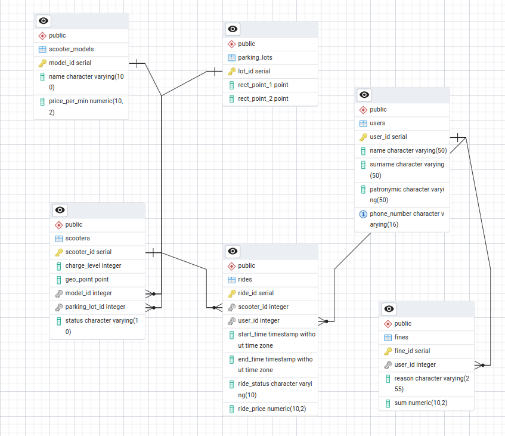

# Scooters-DB

## Задача:
Необходимо создать БД самокатов в городе (PostgreSQL)

### Требования:
- Не менее 6 таблиц
- Минимум одна из таблиц содержит триггер на автоматическое вычисление одного из полей
- Каждая из таблиц обязательно должна содержать ограничения
- Составить не менее 20 осмысленных запросов
- Добавить как минимум 5 процедур
- Добавить индексы и обосновать их использование

## Таблицы БД:
* **Модели самокатов (scooter_models):**
  - model_id (SERIAL, **PK**)
  - name
  - price_per_min

* **Парковки (parking_lots):**
  - lot_id (SERIAL, **PK**)
  - rect_point_1 (POINT, set x1y1 rectangle point)
  - rect_point_2 (POINT, set x2y2 rectangle point)

* **Самокаты (scooters):**
  - scooter_id (SERIAL, **PK**)
  - charge_level (INTEGER, from 0 to 100)
  - geo_point (POINT)
  - modeil_id (INTEGER, **FK**)
  - status (VARCHAR, "active", "parked" and "paused" only)

* **Пользователи (users):**
  - user_id (SERIAL, **PK**)
  - name (VARCHAR)
  - surname (VARCHAR)
  - patronymic (VARCHAR)
  - phone_number (UNIQUE VARCHAR, by regexp '^\+7\(\d{3}\)-\d{3}-\d{4}$', maximum one user per number)

* **Поездки (rides):**
  - ride_id (SERIAL, **PK**)
  - scooter_id (INTEGER, **FK**)
  - user_id (INTEGER, **FK**)
  - start_time (TIMESTAMP)
  - end_time (TIMESTAMP)
  - ride_status (VARCHAR, "now" and "ended" only)
  - ride_price (NUMERIC(10, 2), **calculated on *ride_time* and *price_per_min* from model**)

* **Штрафы (fines)**
  - fine_id (SERIAL, **PK**)
  - user_id (INTEGER, **FK**)
  - reason (VARCHAR)
  - sum (NUMERIC(10, 2))


Более подробно создание **таблиц** описано в комментариях `src/create_db.sql`

Создание **триггеров** описано в комментариях `src/add_triggers.sql`

Создание **процедур** описано в комментариях `src/add_procedures.sql`

Добавление **данных** описано в комментариях `src/insert_data.sql`

Обработка **краевых случаев** описана в комментариях `src/additional_actions.sql`

Примеры **запросов** описаны в комментариях `src/queries.sql`


Для более оптимальных вычислений можно создать индексы для полей 
```sql
CREATE INDEX idx_rides_ride_status ON rides (ride_status);
CREATE INDEX idx_scooter_status ON scooters (status);
```
Поскольку часто запросы требуют проверки статуса поездки и самоката, о чем наглядно говорит содержимое процедур и триггеров.

Диаграмма:<br>
